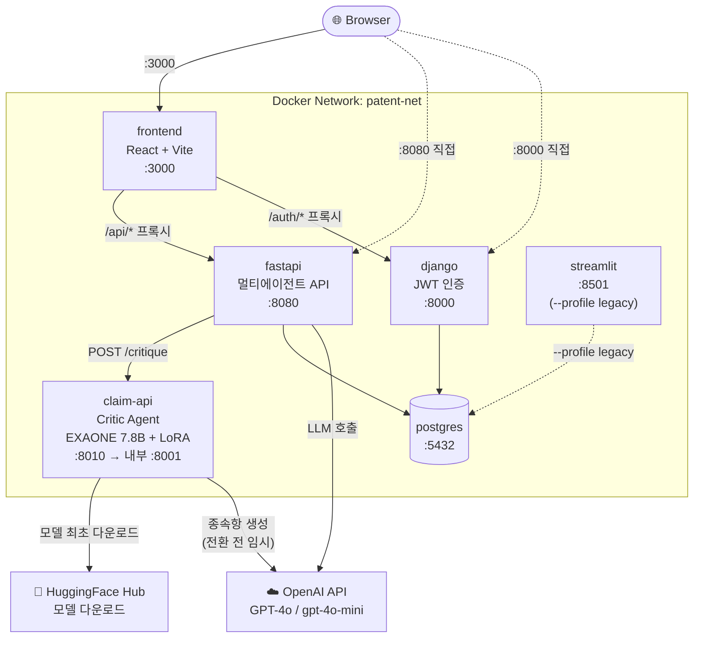
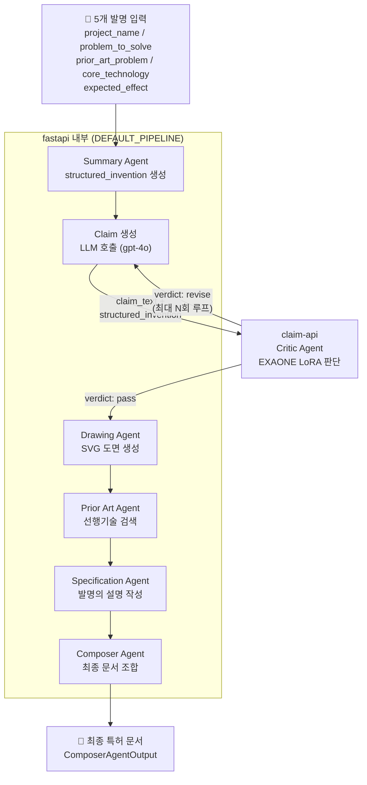
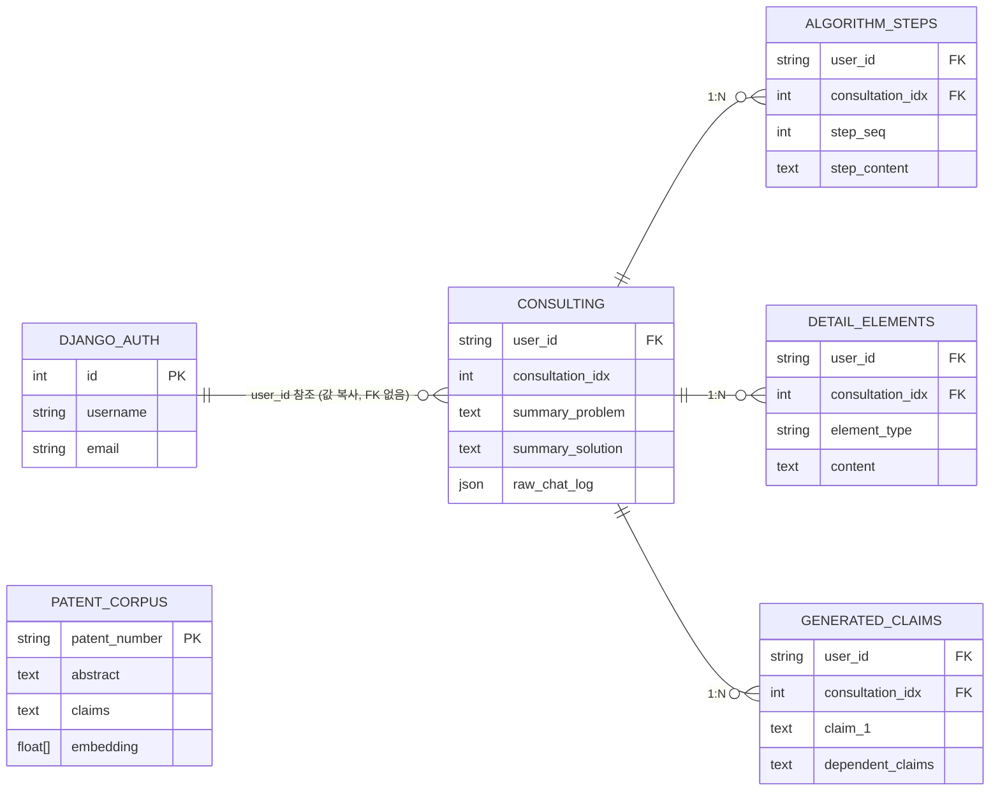

# Patent AI — Docker 컨테이너화 가이드

## 목차
1. [Docker란, 그리고 왜 필요한가](#1-docker란-그리고-왜-필요한가)
2. [전체 아키텍처](#2-전체-아키텍처)
3. [서비스별 역할](#3-서비스별-역할)
4. [포트 구성](#4-포트-구성)
5. [Docker 구성 파일 설명](#5-docker-구성-파일-설명)
6. [실행 방법](#6-실행-방법)
7. [현재 코드에서 수정 필요한 것](#7-현재-코드에서-수정-필요한-것)

---

## 1. Docker란, 그리고 왜 필요한가

### Docker란?

**Docker**는 애플리케이션을 **컨테이너(Container)** 라는 독립된 실행 단위로 묶어주는 도구다.
컨테이너 안에는 코드뿐 아니라 실행에 필요한 Python 버전, 라이브러리, 환경변수 설정까지 전부 포함된다.

> "내 컴퓨터에서는 되는데 서버에서는 안 돼요"
> → Docker를 쓰면 이 문제가 사라진다. 컨테이너는 어디서 실행해도 동일한 환경이다.

### 이 프로젝트에 Docker가 필요한 이유

이 프로젝트는 단일 Python 스크립트가 아니라 **5개의 독립된 서비스**로 구성된다.

| 서비스 | 언어/프레임워크 | 역할 |
|---|---|---|
| frontend | React + TypeScript | 사용자 UI |
| fastapi | Python / FastAPI | 에이전트 파이프라인 API |
| django | Python / Django | JWT 인증 |
| postgres | PostgreSQL | 데이터베이스 |
| claim-api | Python / FastAPI + EXAONE | Critic Agent (GPU) |

이 서비스들이 각자 다른 환경에서 실행되고, 서로를 찾아서 통신해야 한다.  
Docker Compose는 이 모든 서비스를 **한 번의 명령으로 동시에 띄우고**, 내부 네트워크(`patent-net`)로 자동 연결해준다.

```bash
# 이 한 줄이면 전체 환경이 올라온다
docker compose up --build
```

팀원 모두가 같은 환경에서 개발하고, 최종적으로 서버에 동일하게 배포할 수 있다.

---

## 2. 전체 아키텍처

### 서비스 구성도



### 파이프라인 흐름



### DB 테이블 소유 관계



> **DB 공유 정책 (MVP):** Django auth 테이블과 에이전트 테이블이 `patent_ai` 단일 DB를 공유한다.  
> `consulting.user_id`는 Django `accounts_user.id`를 값으로만 참조한다 (FK 제약 없음).  
> 추후 `patent_corpus` 임베딩이 커지면 별도 DB 분리를 검토한다.

### patent_corpus 벡터 검색 구조 (pgvector)

`patent_corpus`는 선행기술 검색 전용 테이블로, 나머지 운영 데이터와 성격이 다르다.

| | 운영 데이터 | patent_corpus |
|---|---|---|
| 용도 | 트랜잭션 읽기/쓰기 | 벡터 유사도 검색 전용 |
| 적재 | API 실시간 | `load_corpus.py` 1회 배치 |
| 검색 | SQL WHERE | 1536-dim 코사인 유사도 |

**기존 방식의 문제:**  
`prior_art_agent.py`가 전체 임베딩을 메모리에 올려 numpy로 코사인 계산 → 코퍼스가 커질수록 RAM 폭증

```python
# 기존 — 전체 로드 후 Python 계산
vectors, corpus = load_corpus_from_db()   # 수만 건 전부 메모리로
scores = _cosine_similarity(query_vec, vectors)  # numpy 배치 계산
```

**pgvector 전환 후:**  
DB 엔진(HNSW 인덱스)이 직접 ANN 검색 → 메모리 사용 없음

```python
# 변경 후 — SQL 한 방으로 Top-N 반환
rows = db.query(PatentCorpus, similarity)
         .order_by(PatentCorpus.embedding.cosine_distance(query_vec))
         .limit(top_n).all()
```

**변경된 파일:**

| 파일 | 변경 내용 |
|---|---|
| `docker-compose.yml` | `postgres:15-alpine` → `pgvector/pgvector:pg15` |
| `agents/consultation/patent_db.py` | `Column(JSON)` → `Column(Vector(1536))` + HNSW 인덱스 |
| `agents/consultation/prior_art_agent.py` | `load_corpus_from_db()` 제거, `search_similar_patents()` SQL 전환 |
| `pyproject.toml` / `requirements.txt` | `pgvector>=0.3.0` 추가 |

**기존 데이터 마이그레이션:**  
`patent_corpus` 테이블이 이미 존재하는 경우 컬럼 타입이 달라 스키마 오류가 발생한다.  
아래 순서로 재적재가 필요하다.

```bash
# 기존 테이블 초기화 후 재적재
docker compose run --rm fastapi \
  python agents/consultation/load_corpus.py --reset --dir data/raw/texts/patents_txt
```

---

## 3. 서비스별 역할

### frontend (React + Vite) — `:3000`

사용자가 직접 보는 화면. Vite 개발 서버가 API 프록시 역할도 한다.

```
/api/*  → fastapi:8080   (파이프라인, 상담)
/auth/* → django:8000    (로그인, 토큰)
```

프로덕션 배포 시에는 `nginx`가 빌드된 정적 파일을 서빙하고 프록시를 처리한다.  
(`docker compose` 의 `target: prod` 으로 전환)

### fastapi (멀티에이전트 API) — `:8080`

이 프로젝트의 핵심 서비스. `agents/` 폴더의 모든 에이전트를 오케스트레이션한다.

| 엔드포인트 | 역할 |
|---|---|
| `POST /api/v1/consultation/start` | 상담 세션 시작 |
| `POST /api/v1/consultation/{id}/message` | 상담 메시지 처리 |
| `POST /api/v1/consultation/{id}/finalize` | 상담 종료 + DB 저장 |
| `POST /api/v1/pipeline/run` | 전체 파이프라인 실행 |
| `GET  /api/v1/pipeline/{job_id}/status` | 단계별 진행 상태 |
| `GET  /api/v1/pipeline/{job_id}/result` | 최종 특허 문서 |

### django (JWT 인증) — `:8000`

인증만 담당. 비즈니스 로직은 없다.

| 엔드포인트 | 역할 |
|---|---|
| `POST /api/auth/signup` | 회원가입 |
| `POST /api/auth/login` | 로그인 (JWT 발급) |
| `POST /api/auth/logout` | 로그아웃 (토큰 블랙리스트) |
| `POST /api/auth/token/refresh` | 액세스 토큰 갱신 |

### claim-api (Critic Agent) — `:8010` `--profile llm`

GPU가 있는 별도 서버(RunPod)에서 실행하는 특수 서비스.  
fastapi가 생성한 청구항을 받아서 **특허청 관점의 품질을 평가**한다.

```
입력: { claim_text, structured_invention }

출력: {
  verdict:               "pass" | "revise" | "reject"
  rejection_probability: 0.0 ~ 1.0
  novelty_score:         0.0 ~ 1.0
  inventive_step_score:  0.0 ~ 1.0
  issues:                ["신규성 부족 - 선행기술과 유사", ...]
  suggestions:           ["구성요소 A를 더 구체화하세요", ...]
}
```

DB 연결 없음. 텍스트를 받아 판단 결과만 반환하는 순수 추론 서비스.  
모델: **EXAONE-3.0-7.8B-Instruct + LoRA** (`silverstone1004/claim`)

### postgres — `:5432`

모든 영속 데이터를 저장. `patent_ai` 단일 DB를 Django와 FastAPI가 공유한다.

---

## 4. 포트 구성

### 포트 일람표

| 서비스 | 호스트 포트 | 컨테이너 내부 포트 | 프로파일 |
|---|---|---|---|
| frontend | **3000** | 3000 | 기본 |
| postgres | **5432** | 5432 | 기본 |
| django | **8000** | 8000 | 기본 |
| fastapi | **8080** | 8080 | 기본 |
| claim-api | **8010** | **8001** | `--profile llm` |
| streamlit | **8501** | 8501 | `--profile legacy` |

호스트 포트 6개 전부 다르다. 중복 없음.

### claim-api 내부 포트를 8001로 분리한 이유

`django`와 `claim-api`가 모두 내부 포트 8000을 쓰면, Docker 컨테이너 이름으로 구분은 되지만 설정을 읽는 사람 입장에서 혼동의 여지가 있다.

```
# 변경 전 — 같은 포트, 헷갈림
django:    8000:8000   (호스트:컨테이너 = 8000:8000)
claim-api: 8010:8000   (호스트:컨테이너 = 8010:8000)

# 변경 후 — 내부 포트도 다름, 의미 명확
django:    8000:8000   (인증 서비스)
claim-api: 8010:8001   (Critic Agent)
```

Docker 네트워크 내부에서 접근 주소:

```
http://django:8000     → JWT 인증 API
http://fastapi:8080    → 멀티에이전트 API
http://claim-api:8001  → Critic Agent
```

---

## 5. Docker 구성 파일 설명

### 파일 구조

```
SKN25-FINAL-3Team/
├── docker-compose.yml          # 전체 서비스 정의
├── .dockerignore               # 빌드 컨텍스트 제외 목록
└── docker/
    ├── Dockerfile.app          # django + fastapi 공용 이미지 (Python 3.11)
    ├── Dockerfile.frontend     # frontend 이미지 (dev: Vite / prod: nginx)
    ├── Dockerfile.claim        # claim-api 이미지 (ML 의존성 포함)
    └── nginx.conf              # 프로덕션 nginx 설정
```

### Dockerfile.app (django + fastapi 공용)

```
python:3.11-slim
    → uv 설치
    → pyproject.toml / uv.lock 기반 의존성 설치
    → 소스 복사
```

`django`와 `fastapi` 두 서비스가 같은 이미지를 쓰고, `command`만 다르게 실행된다.

### Dockerfile.frontend (React)

멀티스테이지 빌드:

| 스테이지 | 역할 |
|---|---|
| `dev` | Vite 개발 서버 (hot reload, `target: dev`) |
| `builder` | `npm run build` 로 정적 파일 생성 |
| `prod` | nginx + 빌드 결과물 서빙 (`target: prod`) |

### Dockerfile.claim (Critic Agent)

```
python:3.11-slim
    → uv + 공통 의존성 (pyproject.toml)
    → ML 의존성 별도 설치:
        torch (CPU wheel, 로컬 테스트용)
        transformers / accelerate / bitsandbytes / peft / trl
```

GPU 환경(RunPod)에서는 `FROM` 베이스 이미지를  
`pytorch/pytorch:2.3.0-cuda12.1-cudnn8-runtime` 으로 교체한다.

### docker-compose 프로파일

| 프로파일 | 추가 서비스 | 용도 |
|---|---|---|
| 기본 (없음) | postgres, django, fastapi, frontend | 일반 개발 |
| `--profile llm` | + claim-api | Critic Agent 포함 테스트 |
| `--profile legacy` | + streamlit | 기존 데모 유지 |

### 볼륨

| 볼륨 | 용도 |
|---|---|
| `postgres_data` | DB 데이터 영속 보관 |
| `uploads` | 파일 업로드 임시 저장 |
| `hf_cache` | HuggingFace 모델 캐시 (재시작 시 재다운로드 방지) |

---

## 6. 실행 방법

### 사전 준비

```bash
# 1. 환경변수 파일 생성
cp .env.example .env

# 2. .env 에 최소한 아래 값 입력
OPENAI_API_KEY=sk-...
```

### 기본 실행

```bash
# 전체 빌드 + 실행
docker compose up --build

# 백그라운드 실행
docker compose up -d --build
```

서비스 접속:

| 서비스 | URL |
|---|---|
| frontend | http://localhost:3000 |
| fastapi (Swagger) | http://localhost:8080/docs |
| django | http://localhost:8000 |
| postgres | localhost:5432 |

### Critic Agent 포함

```bash
# .env 에 HUGGINGFACE_TOKEN 추가 필요
# 첫 실행 시 EXAONE 모델 다운로드 (~16GB)
docker compose --profile llm up --build

# http://localhost:8010/docs
```

### 기존 Streamlit 데모 포함

```bash
docker compose --profile legacy up --build

# http://localhost:8501
```

### 특허 코퍼스 DB 적재 (최초 1회)

```bash
docker compose run --rm fastapi \
  python agents/consultation/load_corpus.py --dir data/raw/texts/patents_txt
```

### 개별 서비스 재시작 / 로그

```bash
# 특정 서비스만 재빌드
docker compose up -d --build fastapi

# 로그 확인
docker compose logs -f fastapi
docker compose logs -f claim-api
```

---

## 7. 현재 코드에서 수정 필요한 것

### 🔴 claim-api — Critic Agent 전환 (silverstone1004 담당)

**파일:** `agents/runpod/main.py`

현재 `/generate-claims` (청구항 생성) 로 구현되어 있다.  
설계 의도는 **Critic Agent** (청구항 품질 판단)이므로 전환이 필요하다.  
내부 포트도 `8000 → 8001`로 변경되었으므로 uvicorn 실행 인자에 주의한다.

**변경할 것:**

```python
# 현재 (생성)
class ClaimRequest(BaseModel):
    consultation_note: str

class ClaimResponse(BaseModel):
    status: str
    claim_1: str
    dependent_claims: str

@app.post("/generate-claims", response_model=ClaimResponse)
def generate_claims(request: ClaimRequest): ...

# uvicorn main:app --host 0.0.0.0 --port 8000
```

```python
# 목표 (판단)
class CritiqueRequest(BaseModel):
    claim_text: str               # fastapi 가 생성한 청구항 전문
    structured_invention: dict    # state["summary"]["structured_invention"]

class CritiqueResponse(BaseModel):
    verdict: str                  # "pass" | "revise" | "reject"
    rejection_probability: float  # 0.0 ~ 1.0
    novelty_score: float
    inventive_step_score: float
    issues: list[str]             # 거절 예상 근거
    suggestions: list[str]        # 개선 제안

@app.post("/critique", response_model=CritiqueResponse)
def critique_claim(request: CritiqueRequest): ...

# uvicorn main:app --host 0.0.0.0 --port 8001  ← 포트 변경
```

---

### 🔴 fastapi — 에이전트 연동 (hwc2000 담당)

**파일:** `backend/fastapi/routers/consultation.py`, `pipeline.py`

현재 모든 엔드포인트가 `501 Not Implemented`를 반환한다.

**consultation.py 연동 대상:**

```python
from agents.consultation.consultation_agent import PatentConsultant
from agents.consultation.prior_art_agent import run_prior_art_agent
```

**pipeline.py 연동 대상:**

```python
from agents.graph import run_pipeline
from agents.state import create_initial_state

# claim-api Critic 호출 (포트 8001 사용)
import httpx, os

CLAIM_BACKEND_URL = os.getenv("CLAIM_BACKEND_URL", "http://claim-api:8001")

async def call_critic(claim_text: str, structured_invention: dict) -> dict:
    async with httpx.AsyncClient(timeout=60) as client:
        res = await client.post(
            f"{CLAIM_BACKEND_URL}/critique",
            json={"claim_text": claim_text,
                  "structured_invention": structured_invention}
        )
        return res.json()
```

---

### 🟡 fastapi — claim 생성 로직 이전 (hwc2000 담당)

**현재:** `agents/runpod/main.py`에 독립항 생성 로직 존재  
**목표:** `backend/fastapi/routers/pipeline.py` 내부로 이전

이전 시 GPU 불필요 → `gpt-4o` 계열 LLM 호출로 처리.  
`agents/claim/claim_agent.py`의 로직과 통합.

---

### 🟡 frontend — 페이지 구현 (담당자 확인 필요)

**파일:** `frontend/src/App.tsx` 및 신규 페이지 파일

현재 라우팅 골격만 존재한다. 구현 우선순위:

1. `/consult` — 상담 UI
   - `POST /api/v1/consultation/start` 호출
   - 채팅 형태 메시지 입력/출력

2. `/pipeline` — 파이프라인 진행 상태
   - `POST /api/v1/pipeline/run` 호출
   - `GET /status` 폴링으로 단계별 진행 상태 표시
   - `GET /result` 로 최종 특허 문서 렌더링

API 호출은 `frontend/src/api/client.ts`의 `api.get()` / `api.post()`를 사용한다.

---

### 🟢 django — 완성, 변경 불필요

JWT 인증은 이미 구현되어 있다.  
Docker 환경에서 `DJANGO_DB_HOST=postgres`만 설정하면 동작한다.

---

### 작업 우선순위 요약

| 우선순위 | 담당 | 작업 | 관련 파일 |
|---|---|---|---|
| 🔴 필수 | silverstone1004 | claim-api `/critique` 전환 + 포트 8001 적용 | `agents/runpod/main.py` |
| 🔴 필수 | hwc2000 | fastapi 에이전트 연동 | `backend/fastapi/routers/` |
| 🟡 중요 | hwc2000 | claim 생성 runpod → fastapi 이전 | `backend/fastapi/routers/pipeline.py` |
| 🟡 중요 | 담당자 | frontend 상담 UI 구현 | `frontend/src/` |
| 🟢 추후 | 전체 | streamlit 제거 | `apps/streamlit/` |
